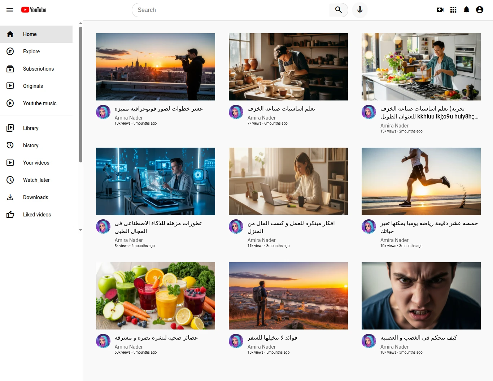

## العربي 🇪🇬 

# 🎬 YouTube Clone (Practice Project)

هذا المشروع عبارة عن **تطبيق عملي** لفيديو تعليمي من قناة [Codezilla](https://m.youtube.com/watch?v=Hnm3BP-tjD8&t=5796s&pp=ygUJY29kZXppbGxh).  

---

الهدف الأساسي منه كان التدريب على 
HTML و CSS
 وفهم كيفية تصميم واجهة مستخدم مشابهة لموقع 
 YouTube.

---

## 📸 Screenshot 


---

## 🌐 Live Demo

يمكنك تجربة المشروع مباشرة من هذا الرابط:  
[🔗 Live Demo](https://amira713.github.io/youtube-clon/)  

---

## 🛠️ ما الذي تم تطبيقه؟

- إنشاء **Header** مشابه لليوتيوب يحتوي على:
  - الشعار
  - مربع البحث
  - أيقونات التحكم
- تصميم **Sidebar navigation** يحتوي على روابط أساسية.
- جزء رئيسي يعرض قائمة من الفيديوهات (صور مصغرة + تفاصيل الفيديو).
- تطبيق بعض خصائص الـ 
CSS
 مثل flexbox و line-clamp**
 للتعامل مع النصوص الطويلة.
- تغيير الصور والعناوين لتجعل المشروع أكثر واقعية.

---

## 🚀 طريقة التشغيل محليًا

1. حمّل أو انسخ هذا المستودع:
   ```bash
   git clone https://github.com/USERNAME/REPOSITORY_NAME.git
2. افتح المجلد على جهازك.
3.شغل ملف index.html على أي متصفح.

⚠️ ملاحظات
المشروع تدريبي فقط، وليس نسخة متكاملة أو متجاوبة بالكامل.
الهدف الأساسي هو التعلم واكتساب المهارات في 
HTML و CSS.


## English 🌍
# 🎬 YouTube Clone (Practice Project)

This project is a **practical implementation** of a tutorial from the [Codezilla YouTube channel](https://m.youtube.com/watch?v=Hnm3BP-tjD8&t=5796s&pp=ygUJY29kZXppbGxh).  

---
The main goal was to **practice HTML and CSS** and understand how to design a user interface similar to YouTube.
---

## 📸 Screenshot


---

## 🌐 Live Demo

You can try the project live here:  
[🔗 Live Demo](https://amira713.github.io/youtube-clon/)  


---

## 🛠️ Features Implemented

- **Header** similar to YouTube containing:
  - Logo
  - Search bar
  - Control icons
- **Sidebar navigation** with essential links.
- Main section displaying a list of videos (thumbnails + video details).
- Usage of **CSS techniques like flexbox and line-clamp** to handle layout and long text.
- Custom images and titles to make the project more realistic.

---

## 🚀 How to Run Locally

1. Clone this repository:
   ```bash
   git clone https://github.com/USERNAME/REPOSITORY_NAME.git
2. Open the project folder.
3. Launch index.html in your browser.

⚠️ Notes
This project is for practice purposes only. It’s not fully responsive or production-ready.
The main focus was on learning and experimenting with HTML and CSS.